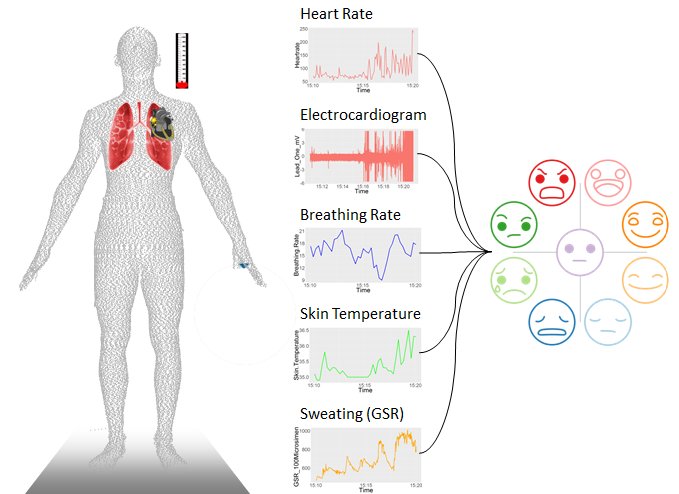
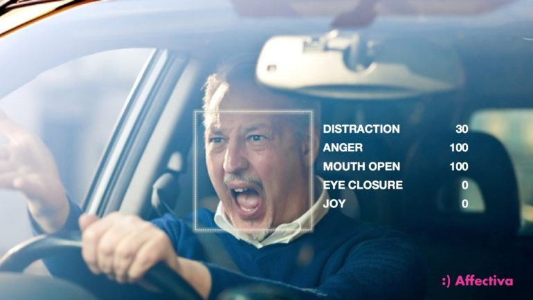

```{r setup, include = FALSE}
# general options --------------------------------------------------------------
options(scipen = 999)
set.seed(123)
# chunk options ----------------------------------------------------------------
knitr::opts_chunk$set(
  cache.extra = knitr::rand_seed, 
  message = FALSE, 
  warning = FALSE, 
  error = FALSE, 
  echo = FALSE,
  cache = FALSE,
  comment = "", 
  fig.align = "center", 
  fig.retina = 3
  )
# libraries --------------------------------------------------------------------
library(magrittr)
library(tidyverse)
library(knitr)
library(scales)
library(nomnoml)
library(flipbookr)
library(tidytext)
library(here)
library(janitor)
library(papaja)
library(mgcv)
library(tweetrmd)
library(gratia)
library(htmltools)
```

```{r xaringan-themer, include = FALSE}
# library(xaringanthemer)
# style_xaringan(code_font_google = google_font("IBM Plex Mono"))
# style_duo(primary_color = "#1F4257", secondary_color = "#F97B64")
```

# Programme

## 1. The (Data) Science of Emotions (30 min)

* 1.1 What Emotions are  are not?
* 1.2 How to Measure Emotions?

## 2. Data Science with R from Scratch (30 min)

* 2.1 The Basics of R Codes
* 2.2 Data Processing with R
* 2.3 Coding in RStudio

## 3. Gentle Introduction to Emotion Analysis (60 min)

* 3.1 Sentiment Analysis
* 3.2 Facial Expression Analysis
* 3.3 Physiology Analysis

## 4. Questions (30 min)

---
class: inverse, mline, center, middle

# 1. The (Data) Science of Emotions

---

# Why Measuring Emotional Experiences?

The emotional experience determines our perceptions and leads our decisions: 
* In every life (e.g., the Phineas Gage Case; Damasio, 1994)

```{r out.width = "50%"}
knitr::include_graphics("media/phineas_gage.jpg")
```

* In consumer behaviours (Dumaine, 1991, p.86) 
  * Emotional appraisal are trigged from aesthetic perceptions (Mahlke, 2008)
  * Choices and decisions are made according both cognitive and emotional appraisals (Bloch, 1995)

---

# Short History of Emotion Science

* Because emotions (passions) were perceived as distinct from the reason and virtue by stoic theories, they were forgotten and left apart from science until Descartes (1649).

* While keeping the idea of distinct concepts, Descartes described the interactions between emotion and cognition.

* Emotions had then to wait two centuries for being declared as an universal adaptive process (which expression is related to the natural selection).

* Finally, modern theories such as Damasio's or many others theories are now not distinguishing emotion and cognition anymore.

```{r out.width = "70%"}

```

---
class: title-slide, middle

## 1.1 What Emotions are and are not?

---

# What Emotions are?

> *“Everyone knows what an emotion is, until asked to give a definition. Then, it seems no one knows.”* (Fehr and Russell, 1984) 

```{r echo=FALSE}
tags$video(
  controls = "true",
  src = "./media/emotion_elicitation.mp4", 
  type = "video/mp4", 
  width = "500",
  height = "500",
  style = "display:block; margin: 0 auto;"
  )
```

---

# What Emotions are not?

Emotions are from the affect / affective state family as well as moods and attitudes. Affective state refers to **"refers to valenced (good versus bad) states"** (Gross, 2010, p. 212).

* Attitudes are **relatively stable beliefs about the goodness or badness of something or someone** (Frijda, 1994). 

* Moods are **less stable than attitudes**, and unlike attitudes, often **do not have specific objects** (Siemer, 2005). 

* Emotions are **the shortest** lived of these three affective processes. They are responses to situations that are perceived as **relevant to an individual’s current goals** (Levenson, 1999).

```{nomnoml, fig.width=12, fig.height=3}
#stroke: orange
#direction: down
#align: center
[Affect]->[Attitude]
[Affect]->[Emotions]
[Affect]->[Moods]
```

---

# Holistic Definition of Emotions

> Emotion is defined as “an **episode of interrelated, synchronized changes** in the states of **all or most of the five organismic subsystems** in **response to the evaluation of an external or internal stimulus** event as relevant to major concerns of the organism” (Scherer, 2001, p.93)

--

```{r out.width = "50%"}
knitr::include_graphics("media/inside_out.gif")
```

--

Scherer, K. R. (2001). Appraisal considered as a process of multilevel sequential checking. In K. R. Scherer, A. Schorr, and T. Johnstone (Eds), *Appraisal processes in emotion: Theory, methods, research* (pp. 92-120). New York: Oxford University Press.

---

# Characteristics of Emotions

From Scherer (2005):

```{r}
tibble::tribble(
             ~Characteristic,                                      ~Description,
               "Event focus", "“something happens to the organism that stimulates or triggers a response after having been evaluated for its significance”",
          "Appraisal driven","“eliciting event and its consequences must be relevant to major concerns of the organism”",
  "Response synchronization", "“all or most of the subsystems of the organism must contribute to response preparation”",
        "Rapidity of change","“emotion processes are undergoing constant modification allowing rapid readjustment to changing circumstances or evaluations”",
        "Behavioural impact","“Emotions prepare adaptive action tendencies and their motivational underpinnings”",
                 "Intensity", "“the response patterns and the corresponding emotional experience [is expected] to be relatively high”",
                  "Duration", "“must be relatively short in order not to tax the resources of the organism and to allow behavioural flexibility”"
  ) %>%
  knitr::kable(format = "html") %>%
  kableExtra::kable_styling(font_size = 16)
```

Scherer, K. R. (2005). *What are emotions? And how can they be measured?*. Social Science Information, 44(4), 695-729.

---

# Functions of Emotions

Still from Scherer (2005), emotions have 5 functions each corresponding to a specific component:

* Evaluation of objects and events (**Cognitive Component**)
* System regulation (**Physiological Component**)
* Preparation and direction of action (**Motivational Component**)
* Communication of reaction and behavioural intention (**Motor/Expressive Component**)
* Monitoring of internal state (**Subjective Feeling Component**)

--

```{nomnoml, fig.width=12, fig.height=4}
#stroke: orange
#align: center

[Emotion|
  [Cognitive Component]->[Motivational Component]
  [Cognitive Component]->[Physiological Component]
  [Cognitive Component]->[Expressive Component]
  [Motivational Component]->[Subjective Component]
  [Physiological Component]->[Subjective Component]
  [Expressive Component]->[Subjective Component]
]

[<abstract>Trigger Event]--:>[Emotion]
```

---

# Cognitive Component

Direct relationship between an event/object and the type of emotion triggered according certain criteria (also called stimulus evaluation check, or SEC, by Scherer, 2001):
* **Relevance** according goals and needs
* **Implication** of consequences
* **Potential Coping** of consequences
* **Significance** for norms, values and standards

```{r out.width="100%"}

```

---

# Physiological Component 

Emotions modulate and influence physiological rhythms:

```{r out.width="70%"}

```

Kreibig, S. D., Samson, A. C., & Gross, J. J. (2013). The psychophysiology of mixed emotional states. *Psychophysiology*, 50(8), 799-811.

---

# Motivational Component

Emotions prepare the body to respond to the environment:

* Triggers **adaptive behaviours** (i.e., Fight or Flight)
* Principles of **Action Tendency/Readiness** (Frijda, 1986)

```{r out.width="70%"}

```

Lowe, R., & Ziemke, T. (2011). The feeling of action tendencies: On the emotional regulation of goal-directed behavior. *Frontiers in Psychology*, 2, 346.

---

# Expressive Component

Vocal and Facial Expressions are used to communicate: 

* **Action Readiness** (Frijda, 1986)
* **Cognitive Appraisal** (Scherer, 2005)
* **Emotion** (Ekman, 1984)
* **Social Message** (Fridlund, 1994)

```{r echo=FALSE, eval=params$eval_rights}
tags$video(
  controls = "true",
  muted = "true",
  src = "./media/media_rights/dynemo_fear_montage.mp4", 
  type = "video/mp4",
  width = "400",
  height = "400",
  style = "display:block; margin: 0 auto;"
  )
```

---

# Subjective Feeling Component

Emotions can be accessed to monitor how the information was processed and which respond was applied:

* **Access to psycho-physiological changes** related to the emotional experience
* **Gives a meaning** to these changes and which allow to voluntarily regulate the emotional state

```{r out.width="50%"}
 
```

Scherer, K. R. (2009). Emotions are emergent processes: They require a dynamic computational architecture. *Philosophical Transactions of the Royal Society B: Biological Sciences*, 364(1535), 3459-3474.

---
class: title-slide, middle

## 1.2 How to Measure Emotions?

---

# Self-Report Analysis

Depending the theoretical framework, multiple emotion self-report scales are possible (**Categorical**, **Dimensional** or **Mixed**):

.pull-left[
*Verbal scales*
* Basic Emotion Theory (C)
* Valence, Activation, Dominance (D)
* Circumplex Model of Affect (M)
* Wheel of Emotions (M)
* Positive Affect and Negative Affect Scale (M)
* Geneva Emotion Wheel (M)

*Non-verbal scales*
* Product Emotion Measurement (C)
* Self Assessment Manikin (D)
* Affect button (D)

Warning: Access to inner states is biased
]

.pull-right[
```{r out.width="70%", fig.cap="Self Assessment Manikin (SAM)"}

```

```{r out.width="50%", fig.cap="Product Emotion Measurement (PrEmo)"}

```
]
  
---

# Sentiment Analysis

Attribute an coefficient to a word or a series of word (e.g., tweets, reviews, books)

.pull-left[
* Can be categorical (e.g., happiness, sadness, fear, anger, ...)

```{r out.width="100%", fig.cap="Credit: Ryo Nakagawara"}

```
]

.pull-right[
* Can be dimensional (positive vs. negative)

```{r out.width="100%", fig.cap="Credit: Samira Munir"}

```
]

---

# Emotion Expression Analysis

Recognition of audio-video recordings of individuals expressing an emotional state:

* From human observers/judges/annotators (need to check consensus)
* From automatic classifiers (e.g., Affectiva Affdex, Noldus FaceReader, Microsoft Cognitive Services, Amazon Rekognition)

```{r out.width="75%", fig.cap="Credit: Affectiva"}

```

---

# Physiology Analysis

Monitoring physiological rhythms with body sensors (e.g., patch sensors, wristbands, belts, shirts).

* More or less invasive
* Very high sample rates
* Can be compared with other data stream (e.g., gps localisation)

.pull-left[
```{r out.width="60%", fig.align="center"}


```
]

.pull-right[
```{r out.width="40%", fig.align="center"}


```
]

---

# Examples in Product Marketing & Design

Investigating emotions to understand consumers' response to product and, therefore, to optimise product sales by comparing:

* **Car designs** with a non-verbal emotion category self-report scale (Desmet, Hekkert, & Hillen, 2003)
* **Car dashboard designs** with a cognitive appraisal self-report scale (Herbeth & Blumenthal, 2013)
* **Smartphone and car designs** with an action readiness implicit task (Schoen & Crilly, 2014)
* **Portable media player interactions and designs** with facial expression measures (Mahlke, 2008)
* **Car interior designs** with physiological measures (Carbon, Michael, & Leder, 2008)

```{r out.width="30%"}
 
```

---
class: inverse, mline, center, middle

# 2. Data Science with R from Scratch

---

# Brief Introduction

Modern data science uses free and open-source computer languages:

* Proprietary languages (e.g., Matlab) and software (e.g., SPSS, Stata, SAS) are outdated
* Main open-source computer languages for data science are Python and R

While Python is the most used language by computer engineers for web and app development, R has some advantages:

* **Easy to write**, to read and to use
* Focused on **reports and journal papers** with reproducibility
* Advanced **statistical packages**
* **Friendly and open** community

So let's useR!

```{r out.width="50%"}
tweet_screenshot(
  tweet_url("Pop_Watson", "1280351422953840640"),
  maxwidth = 300,
  hide_media = TRUE,
  theme = "dark"
  )
```

---
class: title-slide, middle

## 2.1 The Basics of R Codes

---

# What are R and RStudio?

There are some key concepts you need to understand and to remember:

* R is the name of the language
* RStudio is the name of the upgraded interface to write R code

R is usually used via RStudio and First time users often confuse the two. At its simplest, **R is like a car’s engine** while **RStudio is like a car’s dashboard**.

```{r, fig.show="hold", out.width="50%", fig.align="default", fig.cap="R: The engine (left); RStudio: The dashboard (right)"}


```

---

# What are R packages?

R packages extend the functionality of R. They are written by a worldwide community of R users and can be downloaded for free from the internet.

A good analogy for **R packages are like apps you can download onto a mobile phone**.

```{r, fig.show="hold", out.width="50%", fig.align="default", fig.cap="R: A new phone (left); R Packages: Apps you can download (right)"}

knitr::include_graphics("media/phone_design.jpeg")
knitr::include_graphics("media/phone_apps.jpeg")
```

---

# What are R packages?

Say you have purchased a new phone, to use Instagram you need to **install the app once** and to **open the app** every time you want to use it.

The process is very similar for using an R package. You need to:

* **Install the package** with the function `install.packages()`.

```{r echo=TRUE, eval=FALSE}
install.packages("norris")
```

* **“Load” the package** with the function `library()`. 

```{r echo=TRUE, eval=FALSE}
library(norris)
```

Once the package is loaded you can use all the functions from this package such as:

```{r echo=TRUE, eval=FALSE}
get_random_joke()
```

---

# Calling Functions

Functions are algorithms (or lines of code) which transform data to something else. For example, the function `lm()`, uses data to compute the result of a linear regression model.
 
Functions are called by their name and have several arguments that require some information.

```{r echo=TRUE, eval=FALSE}
function_name(argument_1 = value_1, argument_2 = value_2, ...)
```

For example, the function `seq()` makes a sequences of numbers:
* The first argument `from` is the number starting the sequence
* The second argument `to` is last number of the sequence

```{r echo=TRUE, eval=TRUE}
seq(from = 1, to = 10)
```

---

# Type of Values and Objects in R

It is very important to distinguish values and objects in R:

```{r}
tibble::tribble(
                  ~Type,            ~Class,                        ~Example, 
               "Number",   "Numeric Value",                     "1, 2, ...",
     "Word with quotes", "Character Value",             '"one", "two", ...',
  "Word without quotes",     "Object Name", "function name, data name, ..."
  ) %>%
  knitr::kable(format = "html")
```

An object is a box that **can include anything** (e.g., values, dataframes, figures, models, functions, ...) and **has a name** that you have to choose. 

To create an object, you need to **assign something** to a name using the `<-` operator. If you type the name of the object, R will print out its content.

```{r echo=TRUE, eval=FALSE}
x <- 4
x
```

---

# Different R Objects

All object assignments have the same form:

```{r echo=TRUE, eval=FALSE}
object_name <- object_content
```

You want your object names to be descriptive, so you’ll need a convention for multiple words. I recommend **snake_case** where you separate lowercase words with `_`.

```{r, eval=FALSE, echo=TRUE}
numeric_value <- 1

character_value <- "one"

vectors_with_numeric_values <- c(1, 2)

vectors_with_character_values <- c("one", "two")

dataframe_example <- data.frame(col1 = c("one", "two"), col2 = c(1, 2))

functions_example <- function(x){x^2}

plot_example <- ggplot(data = dataframes, aes(x = col1, y = col2)) +
  geom_point()
```

---
class: title-slide, middle

## 2.2 Data Processing with R

---

# Open your Data as R Object (1)

For early beginners, open data with RStudio's `Import Dataset` button:

```{r out.width = '50%'}
knitr::include_graphics("media/rstudio_import.png")
```

Remember that .csv files are basically text files.

If you see your data in the preview, you can click `Import` to create an object containing your data. A code will be executed on the console, **Copy and Paste the first line of this code in your R script**. You will not have to do it manually once the code is in your script.

---

# Open your Data as R Object (2)

To ensure code reproducibility, open data with the appropriate function (e.g., `read.csv()` for csv files).

The main argument of these functions is `file` which corresponds to the path to a file, followed by the name of the file and it extension:

```{r echo=TRUE, eval=FALSE}
my_file_object <- read.csv("C:/path/to/my/file.csv")
```

The following codes will generate an error:

```{r echo=TRUE, eval=FALSE}
# Incomplet path
my_file_object <- read.csv("/path/to/my/file.csv")
# Missing file extension
my_file_object <- read.csv("C:/path/to/my/file")
# Use of backward slash
my_file_object <- read.csv("C:\path\to\my\file.csv")
```

---

# Data Transformation

In R, different style of coding can obtain the same result. The style that I'm using is called **tidyverse** and is much easier to read than other styles:

```{r echo=TRUE, eval=FALSE}
install.packages("tidyverse") # Once
library(tidyverse) # Every time a new session starts
```

There are five functions that you will use to do the vast majority of data manipulations:

- `filter()`: Subset observations (pick observations by their values)

- `select()`: Subset variables (pick variables by their names)

- `mutate()`: Make new variables (create new variables using functions to modify them)

- `summarise()`: Summarise data (collapse many values down to a single summary)

These can all be used in conjunction with `group_by()` which changes the scope of each function from operating on the entire dataset to operating on it group-by-group.

---

# The Pipe Operator %>% (1)

We have see how to create a sequence of numbers from 1 to 10 using the function `seq()`:

```{r echo=TRUE, eval=FALSE}
seq(1, 10)
#  [1]  1  2  3  4  5  6  7  8  9 10
```

If you want to know the sum of the numbers from 1 to 10, you might write some code like:

```{r echo=TRUE, eval=FALSE}
sum(seq(1, 10))
# [1] 55
```

The **tidyverse** makes heavy use of the pipe operator (`%>%`), which takes whatever is on the left-hand-side of the pipe and makes it the first argument of whatever function is on the right-hand-side of the pipe. 

Therefore `seq(1, 10) %>% sum()` is equivalent to `sum(seq(1, 10))`.

```{r echo=TRUE, eval=FALSE}
seq(1, 10) %>% sum()
# [1] 55
```

---

# The Pipe Operator %>% (2)

Imagine you have a dataset made of 2 columns and you want to create a 3rd column which is the result of the addition of column 1 and column 2. Then you want to keep only the observations lower than 10, you might write code like this:

```{r echo=TRUE, eval=FALSE}
data_with_third_column <- mutate(data, column_3 = column_1 + column_2)

data_filter_third_column <- filter(data_with_third_column, column_3 < 10)
```

There’s another way to tackle the same problem with the pipe, `%>%`:

```{r echo=TRUE, eval=FALSE}
data_filter_third_column <- data %>% 
  mutate(column_3 = column_1 + column_2) %>% 
  filter(column_3 < 10)
```

You can read it as a series of imperative statements: 

> Create a new object call `data_filter_third_column` which takes the object `data`, **then** create a new column called `column_3`, **then** filter this column by keeping only the values lower than 10.

A good way to pronounce `%>%` when reading code is **“then”**.

---
class: title-slide, middle

## 2.3 Coding in RStudio

---

# RStudio IDE

When you open RStudio, you’ll see the following 3 windows (also called panes):

* **Console**: where the results are printed
* **Workspace**: where the objects are stored
* **Files, Plots, Package, Help and Viewer**: where data science materials are

```{r out.width='70%'}
knitr::include_graphics("media/rstudio_ide.png")
```

The last window **Code Editor** needs to be opened by clicking:

 * *File* > *New File* > *R Script*

---

# Console: R’s Heart

Where R actually evaluates code:

* Ready to process code if the prompt is `>` . 
* If a command is incomplete at the end of a line, the prompt `+` is displayed
* If the console shows a red icon in the top right corner, the console is currently processing your script

```{r out.width = '30%'}
knitr::include_graphics("media/r_console.png")
```

You can execute code by typing it directly into the Console. However, it won’t be saved. And if you make a mistake you will have to re-type everything all over again. 

Instead, it’s better to write all your code in a document called the **Code Editor**.

---

# Environment: R’s Brain

The Environment tab of this panel shows you the names of all the data objects (like vectors, matrices, and data frames) that you have defined in your current R session. 

You can also see information like the number of observations and rows in data objects. 

```{r out.width = '50%'}
knitr::include_graphics("media/r_environment.png")
```

---

# Files / Plots / Packages / Help

* The **Files** panel gives you access to the file directory on your hard drive.

* The **Plots** panel shows all your plots. There are buttons for opening the plot in a separate window and exporting the plot as a pdf or jpeg.

* The **Packages** shows a list of all the R packages installed on the local or remote machine and indicates whether or not they are currently loaded.

* With the **Help** menu for R functions you can access to essential information to use them. Just have a look at some of them by typing `?` followed by the function name such as:

```{r echo=TRUE, eval=FALSE}
?seq
?lm
```

---

# Code Editor: R's Nervous System

It makes the link between all the previous pane and allows to reproduce actions and behaviours.

```{r out.width = '50%'}
knitr::include_graphics("media/rstudio_panes.png")
```

Each line corresponds to a command except if:

* A function is spread on multiple lines until the closing brackets
* A `%>%` operator is used to chain multiple commands 
* A `+` operator is used to add multiple layers to a ggplot

All text starting with the symbol `#` is not computed and used as a comment to give information.

---

# Become Expert in R

Because R is free, plenty of free learning materials are available online:

* Video tutorials

* Book tutorials, see for example:
  - [R for Data Science](https://r4ds.had.co.nz/) by Wickham & Grolemund (2017)
  - [A ModernDive into R and the tidyverse](https://moderndive.com/) by Ismay & Kim (2019)
  - [Getting Used to R, RStudio, and R Markdown](https://rbasics.netlify.com/) by Kennedy (2019)
  - [Introduction to Open Data Science](https://ohi-science.org/data-science-training/) by the Ocean Health Index Team (2019)
  
* Interactive tutorials, see for example:
  - [RStudio Primers](https://rstudio.cloud/learn/primers)
  - [R-Bootcamp](https://r-bootcamp.netlify.com)
  - [Introduction to R](https://www.quantargo.com/courses/course-r-introduction)
  - [DCU R tutorials](https://dcu-r-tutorials.netlify.app)

---
class: clear
<p style="text-align:center;">**Time to enter ...**

--

```{r}

```

---

# Rstudio Cloud

1. Go to: https://rstudio.cloud/
2. Sign up
3. In your workspace, Click the **drop-down arrow** next to "new project"
4. Use the following GitHub repository:
* **https://github.com/damien-dupre/data_analytics_for_behavioural_research**

```{r out.width='100%'}

```

---

# How to solve your pRoblems

1. Look at your error
  * If it's obvious, solve it by yourself
  * If it's not obvious, copy paste the error in google
  
2. Look at your object (`str(ObjectName)`)

3. Look at the function (documentation)

4. Look at the web
  * Google "R how to ..."
  * Stack Overflow

---
class: inverse, mline, center, middle

# 3. Gentle Introduction to Emotion Analysis

---
class: title-slide, middle

## 3.1 Sentiment Analysis

---

# Principes of Basic Sentiment Analysis

There are two main techniques for Sentiment Analysis:

* Lexicon matching: simple and fast but only analysis of words
* Machine learning (i.e., BERT): complicated and slow but focus on groups of word

--

Several lexicon databases of all existing words weighted accord their emotionality are available:

* Associate each word of a text with its corresponding lexicon value
* Average the results according unit of interest (sentence, chapter, tweet, comment)

```{nomnoml, fig.width=12, fig.height=4}
#stroke: orange
#align: center

[Sentiment Analysis Approaches]->[Machine Learning]
[Sentiment Analysis Approaches]->[Lexicon Based]
[Machine Learning]->[Supervised Learning]
[Machine Learning]->[Unsupervised Learning]
[Lexicon Based]->[Dictionary Based]
[Lexicon Based]->[Corpus Based]
```

---

# Lexicon Based Approach

Three of these lexicons are based on unigrams, (i.e., single words):

* The `nrc` lexicon categorizes words in a binary fashion (“yes”/“no”) into categories of positive, negative, anger, anticipation, disgust, fear, joy, sadness, surprise, and trust 
* The `bing` lexicon categorizes words in a binary fashion into positive and negative categories
* The `afinn` lexicon assigns words with a score that runs between 5 (positive sentiment) and -5 (negative sentiment) 

> Research Question: **Despite the limitations of the lexicon based approach, can sentiment analysis identify the evolution of emotion expressed in a text?**

---
class: split-three, center, clear

.column[

`nrc` lexicon

```{r}
head(get_sentiments("nrc"), 10) %>% knitr::kable(format = "html")
```

]

.column[

`bing` lexicon

```{r}
head(get_sentiments("bing"), 10) %>% knitr::kable(format = "html")
```

]

.column[

`afinn` lexicon

```{r}
head(get_sentiments("afinn"), 10) %>% knitr::kable(format = "html")
```

]

---

```{r tidy-text-data, eval=FALSE, echo=FALSE}
library(tidyverse)
library(tidytext)

c(
    "I love R",
    "R is magic",
    "It is hard and boring at the beginning",
    "but once you have started",
    "you just can't stop using it"
  ) %>% 
  as_tibble_col(column_name = "text") %>% 
  rownames_to_column("line") %>%
  unnest_tokens(output = word, input = text) %>% 
  anti_join(stop_words, by = "word") %>% 
  inner_join(get_sentiments("bing"), by = "word") %>% 
  count(sentiment) %>% 
  ggplot() +
  aes(x = sentiment, y = n/sum(n)) +
  geom_col(fill = c("darkblue", "darkred"), width = 0.5) +
  scale_x_discrete("") +
  scale_y_continuous(
    "Propotion in text", 
    limits = c(0, 1), 
    labels = scales::percent
  ) +
  theme_light() +
  theme(text = element_text(size = 20))
```

`r chunk_reveal("tidy-text-data", title = "# Tidy Text Example", break_type = "auto", widths = c(40, 30, 0))`

---

# Dealing with Real Text

* Load libraries

```{r, echo=TRUE}
library(tidyverse)
library(tidytext)
library(janeaustenr)
```

* Some data wrangling

```{r, echo=TRUE}
jane_tidy <- austen_books() %>%
  group_by(book) %>%
  mutate(linenumber = row_number()) %>% 
  mutate(chapter = str_detect(text, "CHAPTER") %>% cumsum()) %>%
  ungroup() %>%
  filter(chapter != 0) %>% 
  unnest_tokens(word, text)
```

* Remove stop word

```{r, echo=TRUE}
jane_tidy_words <- jane_tidy %>% 
  anti_join(stop_words, by = "word")
```

---

# Dealing with Real Text

```{r, echo=TRUE, fig.width=12, fig.height=3}
jane_tidy_words %>% 
  filter(book == "Emma") %>% 
  count(chapter) %>% 
  ggplot() + 
  aes(chapter, n) +
  geom_line() + 
  geom_smooth(method = "loess", se = FALSE, color = "orange", span = 0.5) +
  scale_x_continuous("Chapter", breaks = seq(0, 60, by = 5)) +
  scale_y_continuous("Amount of words\n(stop words excluded)") +
  ggtitle("Length by chapters in 'Emma'") +
  theme_light() +
  theme(text = element_text(size = 14, family = "mono"))
```

---

# Sentiment Analysis Step by Steps

* Download Emotion Lexicon

```{r, echo=TRUE}
bing_lexicon <- get_sentiments("bing")
```

* Attribute the emotionality to all the words

```{r, echo=TRUE}
jane_austen_sentiment <- jane_tidy_words %>%
  inner_join(bing_lexicon, by = "word") %>%
  count(book, chapter, sentiment) %>% 
  pivot_wider(names_from = sentiment, values_from = n) %>%
  mutate(sentiment = (positive - negative)/(positive + negative))
```

---

# Sentiment Analysis Step by Steps

```{r, echo=TRUE, fig.width=12, fig.height=4}
ggplot(jane_austen_sentiment, aes(chapter, sentiment, fill = book)) +
  geom_col(show.legend = FALSE) + 
  scale_x_continuous("Chapter") +
  scale_y_continuous("Sentiment Proportion", labels = scales::percent) +
  facet_wrap(~ book, ncol = 2, scales = "free_x") +
  theme_light() +
  theme(
    text = element_text(size = 14, family = "mono"),
    strip.text = element_text(color = "black", face = "bold.italic")
  )
```

---

# What About Another Lexicon?

* Download the `afinn` Lexicon

```{r, echo=TRUE}
afinn_sentiments <- get_sentiments("afinn")
```

* Plot the results

```{r, echo=TRUE, fig.width=12, fig.height=3}
jane_tidy_words %>% 
  inner_join(afinn_sentiments, by = "word") %>%
  group_by(book, chapter) %>% 
  summarise(avg_score = mean(value)) %>%
  ggplot(aes(chapter, avg_score, group = book, colour = book)) + 
  geom_line() + 
  geom_smooth(se = FALSE)
```

---

# Identifying most Positive Book

I will be honest, I haven't read any of Jane Austin's book. However, based on their summary, Emma appears to be the most positive book.

> Hypothesis: The average sentiment of all words contained in Emma is significantly higher than in any of the other books.

$H_{1.1}: \mu_{Emma} > \mu_{Sense \& Sensibility}$

$H_{1.2}: \mu_{Emma} > \mu_{Northanger Abbey}$

$H_{1.3}: \mu_{Emma} > \mu_{Mansfield Park}$

---

# Identifying most Positive Book

```{r echo=TRUE}
lm_model <- jane_austen_sentiment %>% 
  mutate(book = factor(book) %>% fct_relevel("Emma")) %>% 
  lm(formula = sentiment ~ book, data = .)

lm_model %>% 
  apa_print() %>% 
  use_series("table") %>% 
  kable(format = "html")
```

Unfortunately, none of the average sentiment is significantly different than the one for Emma (*p*s > 0.05).

---
class: title-slide, middle

## 3.2 Facial Expression Analysis

---

# Automatic Facial Expression Recognition

Development of the technology

* First attempt by reported by Suwa, Sugie, & Fujimura (1978)
* Numerous different academic systems since (see revue by Zeng et al., 2009)
* VicarVision first company to provide a commercial access to FaceReader in 2005
* Today more than 20 companies for applications to automotive, sport, health, human resources, security or marketing purposes

.pull-left[
A process in 3 steps:

* Face Detection
* Facial Landmark Detection
* Classification

Result is a recognition probability for a labelled category (e.g., Action Unit, Basic Emotion, Dimension)
]

.pull-right[
```{r out.width="80%"}
knitr::include_graphics("media/automatic_steps.png")
```
]

---

# Back to the Theory

Barrett et al. (2019) revealed that there is no scientific evidence of:

* The relationship between emotion felt and facial expressions
* The universality of the patterns used to express emotions

```{r out.width="100%", fig.cap="Emotion recognized as 'Anger' but the context reveals an experience closer to 'Intense Joy'"}
knitr::include_graphics("media/automatic_rec.png")
```

---

# Spontaneous Facial Expressions

Participants were filmed without their knowledge while watching videos (Tcherkassof et al., 2013). Eight video clips were taken from this database and judged by human observers as expressing happiness, surprise, fear and disgust (expressed by both males and females). 

> Research Question: **Can an automatic classifier recognize the emotion identified by human observers?**

```{r, eval=params$eval_rights, fig.show="hold", out.width="25%", fig.align="default"}
knitr::include_graphics("media/media_rights/happiness_f.gif")
knitr::include_graphics("media/media_rights/surprise_f.gif")
knitr::include_graphics("media/media_rights/fear_f.gif")
knitr::include_graphics("media/media_rights/disgust_f.gif")
```

```{r, eval=params$eval_rights, fig.show="hold", out.width="25%", fig.align="default"}
knitr::include_graphics("media/media_rights/happiness_m.gif")
knitr::include_graphics("media/media_rights/surprise_m.gif")
knitr::include_graphics("media/media_rights/fear_m.gif")
knitr::include_graphics("media/media_rights/disgust_m.gif")
```

---

# Transform the Data before Analysis

```{r, echo=TRUE}
# libraries --------------------------------------------------------------------
library(tidyverse)
library(here)
library(janitor)
library(papaja)
library(mgcv)

# data wrangling ---------------------------------------------------------------
automatic_recognition_tidy <- "data/automatic_recognition_data.csv" %>% 
  here() %>% 
  read_csv() %>% 
  clean_names() %>% 
  select(source, time_stamp, joy, fear, disgust, sadness, anger, surprise) %>% 
  pivot_longer(
    cols = joy:surprise, 
    names_to = "emotion_recognized", 
    values_to = "value"
  ) %>% 
  separate(source, c("emotion_expressed", "gender"), sep = "[.]") %>% 
  mutate(type = case_when(
    emotion_recognized == emotion_expressed ~ "target",
    TRUE ~ "non-target"
  ))
```

---

# Recognition of the Six Emotions

```{r, echo=TRUE, fig.width=12, fig.height=5}
automatic_recognition_tidy %>% 
  ggplot(aes(time_stamp, value, color = emotion_recognized)) + 
  geom_line(size = 2) +
  scale_x_continuous("Time (s)") +
  scale_y_continuous("Recognition Probability") +
  scale_color_discrete("Emotion Recognized") +
  facet_grid(gender ~ emotion_expressed) + 
  theme(legend.position = "bottom")
```

---

# Recognition of the Target Emotion

```{r, echo=TRUE, fig.width=12, fig.height=5}
automatic_recognition_tidy %>% 
  filter(type == "target") %>% 
  ggplot(aes(time_stamp, value)) + 
  geom_line(size = 2) +
  scale_x_continuous("Time (s)") +
  scale_y_continuous("Recognition Probability (target only)") +
  facet_grid(gender ~ emotion_expressed)
```

---

# Target vs. Non-Target

> Hypothesis: The average probability for the recognition of target emotions will be higher than the average probability for the recognition of non-target emotions regardless of the type of emotion

$H_1: \mu_{target} > \mu_{nontarget}$
$H_0: \mu_{target} = \mu_{nontarget}$

```{r, echo=FALSE}
avg_type <- automatic_recognition_tidy %>% 
  group_by(type) %>% 
  summarise(avg_value = mean(value) %>% round(2))

m_target <- avg_type$avg_value[avg_type$type == "target"]
m_nontarget <- avg_type$avg_value[avg_type$type == "non-target"]
```

```{r, echo=TRUE}
lm_model <- lm(value ~ type, data = automatic_recognition_tidy)

lm_result <- apa_print(lm_model)$full_result$typetarget
```

The difference between the probability for the recognition of the target emotion is significantly higher than for the recognition of the non-target emotion ( $M_{target} = `r m_target`$ vs. $M_{nontarget} = `r m_nontarget`$, `r lm_result`)

---
class: title-slide, middle

## 3.3 Physiology Analysis

---

# Link Physiology-Emotion

A considerable number of studies were performed in order to identify the physiological correlates of emotions. To name a few:

* Heart Rate and Electrodermal Activity categorization according to Valence and Activation (Lang, Bradley and Cuthbert, 1990)
* Somatovisceral afferance model of emotion (Cacioppo et al., 2000)
* Physiological response specificity in emotion when considering subtypes of distinct emotions (meta-analysis by Kreibig, 2010)

--

With the generalization of wireless physiological sensors, new projects were launched to evaluate emotions (and other psychological states):

* Driver psychological state (e.g., Li et al., 2016)
* Health real-time monitoring (e.g., Picard et al., 2015)
* Overall stress detection (e.g., Ollander et al., 2016)
* Sport science (e.g., Cavalade et al., 2015)

---

# Affective Computing Perspective 

Some physiological databases were developed to allow machine learning systems to identify the physiological patterns of emotions, for example:

* Database for Emotion Analysis using Physiological Signals (DEAP; Koelstra et al., 2012)
* Multi-Modal Emotion Recognition in Response to Videos (MAHNOB-HCI; Soleymani et al., 2012)
* Affective computing challenges to recognize emotions from physiological measures (AV+EC 2019: “State-of-Mind, Detecting Depression with AI, and Cross-Cultural Affect Recognition”)

```{r out.width="30%"}

```

---

# Emotion Dimensions from Physiology

Exactly as for facial expressions, there is currently no scientific evidence of specific physiological patterns corresponding to emotion categories.

However, some physiological rhythms seem to reveal dimensions of emotions:
 
* Activation/Arousal: Heart Rate (HR), Breathing Rate (BR), Skin Temperature (ST), Electrodermal Activity (EDA, also called GSR)
* Valence/Pleasure: Heart Rate Variability (HRV, High Frequency)

--

> Research Question: **By measuring multivariate physiological rhythms, is it possible to identify the underlying changes in emotion activation?**

--

Data Processing Steps:

```{nomnoml, fig.width=12, fig.height=2}
#stroke: orange
#align: center

[Cleaning Data Streams]->[Feature Extraction]
[Feature Extraction]->[Streams Sync]
[Streams Sync]->[Statistical Treatment]
```

---

# Cleaning the Data Streams

Due to the context of the measurement "in the wild" and their high sample rate, physiological measures have an awful amount of artefacts.

.pull-left[
* Identification of artefacts

```{r}
tibble::tribble(
              ~Measurement, ~`Minimun`, ~`Maximum`,
              "Heart Rate",   "50 bpm",  "220 bpm",
          "Breathing Rate",   "10 rpm",   "60 rpm",
        "Skin Temperature",     "30°C",     "40°C",
  "Electrodermal Activity",     "2 μS",    "20 μS"
  ) %>%
  knitr::kable(format = "html")
```
]

.pull-right[

* Artefact removal strategies
  * Remove participant
  * Remove value
  * Replace value with approximate
  
```{r out.width = "80%"}

```
]

---

# Feature Extraction

Some data streams are directly interpretable (i.e., they are physiological feature per se):

* Heart Rate (HR)
* Breathing Rate (BR)
* Skin Temperature (ST)

Other data streams need feature extraction treatment to be interpretable:

.pull-left[
* Electrodermal Activity (EDA) is converted into Skin Conductance Level (SCL) and Skin Conductance Response (SCR):

```{r out.width = "100%"}

```
]

.pull-right[

* Electrocardiogram (ECG) features analysing the regularity of the distance between peaks (R-R intervals): 

```{r out.width = "100%"}

```

Can be easily done with the {RHRV} package in R
]

---

# Streams Sync

Another challenge with multivariate time-series analysis is to merge their values. 
Problems occur when they:

* Start/Stop at different times
* Have different sample rates (Measurement Frequencies)

.pull-left[
Example of sample rates from Dupré et al. (2017):

```{r}
tibble::tribble(
                         ~Signal, ~`Sample rate`,
       "Electrocardiogram (ECG)",       "256 Hz",
               "Heart Rate (HR)",      "25.6 Hz",
           "Breathing Rate (BR)",      "25.6 Hz",
  "Accelerometer (ACC - 3 Axis)",      "25.6 Hz", 
         "Skin Temperature (ST)",      "0.08 Hz",
  "Electrodermal Activity (EDA)",         "2 Hz"
  ) %>%
  knitr::kable(format = "html") %>% 
  kableExtra::kable_styling(font_size = 14)
```
]

.pull-right[
Potential solutions to merge multivariate time-series:

* Keeping only the common timestamps
* Extrapolation of the missing between values (linear or spline approximation)
]

---

# Statistical Treatment

In the previous sections, sentiment and facial expression time-series have been analysed using linear regressions by supposing each measure/observation are independent (linear regression requirement).

.pull-left[
However, with time-series this assumption is borderline because an observation at $t_{x}$ probably depends on the value of the observation $t_{x-1}$ (also called autocorrelation).

To take care of time-series autocorrelation and  to identify the trend behind multivariate time-series, a non-linear regression needs to be used.
]

.pull-right[
```{r out.width = "100%"}

```
]

> Research Question: **In simulated multivariate physiological time-series, is it possible to identify a non-linear underlying trend corresponding to individual's emotional activation?**

---

# Predict Activation from Physiology

```{r, echo=TRUE}
# libraries --------------------------------------------------------------------
library(tidyverse)
library(zoo)
library(dygraphs)
library(mgcv)

# data -------------------------------------------------------------------------
data_HR_sim <- here("data/data_HR_sim.csv") %>% read_csv()
data_BR_sim <- here("data/data_BR_sim.csv") %>% read_csv()
data_ST_sim <- here("data/data_ST_sim.csv") %>% read_csv()
data_EDA_sim <- here("data/data_EDA_sim.csv") %>% read_csv()

# example structure ------------------------------------------------------------
str(data_HR_sim)
```

---

# Predict Activation from Physiology

```{r, echo=TRUE}
# prepare HR, BR and ST time-series --------------------------------------------
data_HR <- data_HR_sim %>%
  rename(value = Heartrate) %>%
  mutate(
    measure = "HR",
    time_date = as.POSIXct(time/1000, origin = "1970-01-01", tz = "Europe/London")
  )

data_BR <- data_BR_sim %>%
  rename(value = Breathing.Rate) %>%
  mutate(
    measure = "BR",
    time_date = as.POSIXct(time/1000, origin = "1970-01-01", tz = "Europe/London")
  )

data_ST <- data_ST_sim %>%
  rename(value = Skin.Temperature) %>%
  mutate(
    measure = "ST",
    time_date = as.POSIXct(time/1000, origin = "1970-01-01", tz = "Europe/London")
  )
```

---

# Predict Activation from Physiology

```{r, echo=TRUE}
# prepare EDA time-series ------------------------------------------------------
data_EDA <- data_EDA_sim %>%
  rename(value = EDA_100Microsimens) %>%
  mutate(
    measure = "EDA",
    time_date = as.POSIXct(time/1000, origin = "1970-01-01", tz = "Europe/London")
  )

# extract features from EDA ----------------------------------------------------
data_zoo <- loess(value ~ time, data = data_EDA, span = 0.35)
data_EDA$SCL <- data_zoo$fitted
data_EDA$SCR <- data_zoo$residuals
```

```{r, echo=FALSE, fig.width=12, fig.height=3}
data_EDA %>% 
  ggplot(aes(x = time_date)) +
  geom_line(aes(y = value)) +
  geom_line(aes(y = SCL), color = "green", size = 2) +
  geom_line(aes(y = SCR), color = "lightgreen") +
  theme_apa()
```

---

# Predict Activation from Physiology

```{r, echo=TRUE}
# center scale -----------------------------------------------------------------
data_HR_zoo <- zoo(data_HR$value, order.by = data_HR$time_date) %>% 
  scale(center = TRUE, scale = TRUE)
data_BR_zoo <- zoo(data_BR$value, order.by = data_BR$time_date) %>% 
  scale(center = TRUE, scale = TRUE)
data_ST_zoo <- zoo(data_ST$value, order.by = data_ST$time_date) %>% 
  scale(center = TRUE, scale = TRUE)
data_SCL_zoo <- zoo(data_EDA$SCL, order.by = data_EDA$time_date) %>% 
  scale(center = TRUE, scale = TRUE)

# merge and fill ---------------------------------------------------------------
data_physio <- merge.zoo(
    HR = data_HR_zoo, 
    BR = data_BR_zoo, 
    ST = data_ST_zoo, 
    SCL = data_SCL_zoo
  ) %>%
  na.approx()

# pivot data to long table -----------------------------------------------------
data_physio_tidy <- data_physio %>% 
  fortify.zoo() %>% 
  pivot_longer(-Index, names_to = "measure", values_to = "value") %>% 
  mutate(Index = as.numeric(Index))
```

---

# Predict Activation from Physiology

```{r, echo=TRUE, fig.width=11, fig.height=4}
dygraph(data_physio) %>%
  dyRangeSelector() %>%
  dyOptions(colors = c("red", "blue", "orange", "green", "purple")) %>%
  dyLegend(width = 500)
```

---

# Predict Activation from Physiology

Once the data are synced and merged, it is possible to test their underlying trend.

> Hypothesis: The evolution of the time-series trend (also called $b_{j}$) is significantly different than a linear evolution.

$H1: b_{j} \neq 0$
$H0: b_{j} = 0$

```{r, echo=TRUE}
gam_physio <- gam(
  formula = value ~ s(Index), 
  data = data_physio_tidy,  
  method = "REML", 
  correlation = corAR1()
  )

tidy(gam_physio) %>% 
  mutate(p.value = pvalue(p.value)) %>% 
  kable(format = "html", digits = 2)
```

---

# Predict Activation from Physiology

```{r, echo=TRUE, fig.width=12, fig.height=4}
draw(gam_physio)
```

While taking into account time-series autocorrelation, the Generalized Additive Model (GAM) reveal a significant non-linearity of the underlying trend which can be due to participant's emotional activation:

* A first peak of activation is observed in the first milliseconds
* Then, activation seems to decrease
* Finally, an important peak is observed at the end of the measurement

---

# Example of Emotional Trends

```{r echo=FALSE, eval=params$eval_rights}
tags$video(
  controls = "true",
  src = "./media/media_rights/mountain_bike_emotion.mp4", 
  type = "video/mp4", 
  width = "600",
  height = "600",
  style = "display:block; margin: 0 auto;"
  )
```

---
class: inverse, mline, center, middle

# Thanks for your attention!

## Questions?
